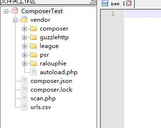

# Composer使用文档

## Composer配置

 查看composer全局设置

```bash
composer config -gl
```

查看composer全局镜像

```bash
composer config -g repo.packagist
```

### Packagist 镜像使用方法

有两种方式启用本镜像服务：

* 系统全局配置： ****即将配置信息添加到 Composer 的全局配置文件 `config.json` 中。见“方法一”
* 单个项目配置： ****将配置信息添加到某个项目的 `composer.json` 文件中。见“方法二”

#### **方法一：** 修改 composer 的全局配置文件**（推荐方式）** <a id="-composer-"></a>

打开命令行窗口（windows用户）或控制台（Linux、Mac 用户）并执行如下命令：

```text
composer config -g repo.packagist composer https://packagist.phpcomposer.com
```

#### **方法二：** 修改当前项目的 `composer.json` 配置文件： <a id="-composer-json-"></a>

打开命令行窗口（windows用户）或控制台（Linux、Mac 用户），进入你的项目的根目录（也就是 `composer.json` 文件所在目录），执行如下命令：

```text
composer config repo.packagist composer https://packagist.phpcomposer.com
```

上述命令将会在当前项目中的 `composer.json` 文件的末尾自动添加镜像的配置信息（你也可以自己手工添加）：

```text
"repositories": {
    "packagist": {
        "type": "composer",
        "url": "https://packagist.phpcomposer.com"
    }
}
```

 以 laravel 项目的 `composer.json` 配置文件为例，执行上述命令后如下所示（注意最后几行）：

```text
{
    "name": "laravel/laravel",
    "description": "The Laravel Framework.",
    "keywords": ["framework", "laravel"],
    "license": "MIT",
    "type": "project",
    "require": {
        "php": ">=5.5.9",
        "laravel/framework": "5.2.*"
    },
    "config": {
        "preferred-install": "dist"
    },
    "repositories": {
        "packagist": {
            "type": "composer",
            "url": "https://packagist.phpcomposer.com"
        }
    }
}
```

 OK，一切搞定！试一下 `composer install` 来体验飞一般的速度吧！

## **安装组件和如何使用组件**

下面我们通过一个示例项目来演示如何使用Composer和组件来开发一个PHP应用，这个应用的作用是扫描一个CSV文件中的URL，找出死链，该应用会向每个URL发HTTP请求，如果返回的HTTP状态码大于等于400，就把这个死链发给标准输出。这是一个命令行应用，开发好之后，我们会执行这个脚本，传入csv文件的路径，在标准输出中显示死链列表。

### **安装组件**

开始之前，先看看哪些任务可以使用现有的PHP组件解决：我们需要一个可以迭代处理csv文件数据的组件，此外还要向csv文件中的每个URL发送HTTP请求，因此还需要一个可以发送HTTP请求并检查HTTP响应的组件。

浏览Packagist后，我们找到`guzzlehttp/guzzle`和`league/csv`两个组件，前者用于处理HTTP消息，后者用于处理CSV数据。下面我们在项目最顶层运行如下命令：

```text
composer require guzzlehttp/guzzle
composer require league/csv
```

Composer会将依赖安装到根目录的`vendor`目录下，安装完成后，会在根目录下生成`composer.json`和`composer.lock`文件：



`composer.lock`文件中会列出项目使用的所有PHP组件，以及组件的具体版本号，这其实是锁定了项目，让项目只能使用具体版本的PHP组件。这样的好处是，composer会下载这个文件中列出的具体版本，而不管Packagist中可用的最新版本是多少，你应该把`composer.lock`文件纳入版本控制，这样让团队成员使用的PHP版本和你一样，如果本地开发和服务器使用的PHP组件版本相同，可以尽量降低由组件版本不同导致的bug。

如果确实要下载最新版本的组件并更新`composer.lock`，可以使用`composer update`命令。

### **自动加载**

接下来我们来编写应用代码，在根目录下创建一个`scan.php`文件，然后在该文件顶部使用`require`导入Composer创建的自动加载器：

```text
<?php
require 'vendor/autoload.php';
```

Composer创建的自动加载器其实就是个名为`autoload.php`的文件，保存在`vendor`目录中，Composer下载各个PHP组件时，会检查每个组件的`composer.json`文件，确定如何加载该组件，得到这个信息后，Composer会在本地为该组件创建一个符合PSR标准的自动加载器。这样我们就可以实例化项目中的任何PHP组件，这些组件按需自动加载。

### **编写代码**

下面我们正式使用Guzzle和CSV组件编写`scan.php`代码：

```php
<?php
//使用composer自动加载器
require 'vendor/autoload.php';

//实例Guzzle Http客户端
$client = new GuzzleHttp\Client();

//打开并迭代处理CSV
$csv = League\Csv\Reader::createFromPath($argv[1]);
foreach ($csv as $csvRow) {
    try {
        //发送HTTP GET请求
        $httpResponse = $client->get($csvRow[0]);

        //检查HTTP响应的状态码
        if($httpResponse->getStatusCode() >= 400) {
            throw new Exception();
        }
    } catch (Exception $e) {
            //把死链发给标准输出
            echo $csvRow[0] . PHP_EOL;
    }
}
```

下面我们在`urls.csv`中添加一些URL，一行一个，而且至少有一个是死链：

```text
http://baidu.com
http://bing.com
http://taobao.com
https://laravelacademy.org
http://test123.com
```

然后打开终端，执行`scan.php`脚本：

```text
php scan.php urls.csv
```

我们传入了两个参数，第一个是脚本文件`scan.php`的路径，另一个是CSV文件的路径。输出如下：

```text
$ php scan.php urls.csv
http://test123.com
```


