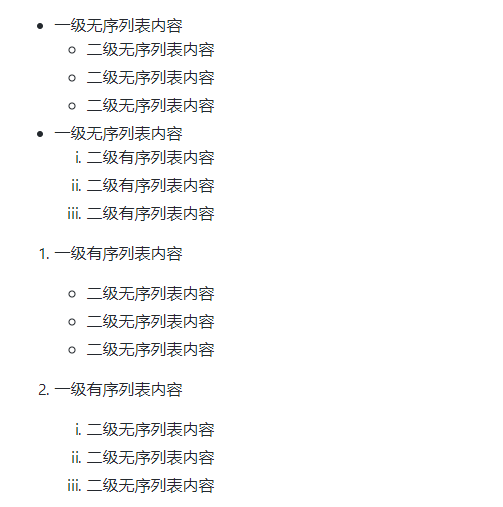
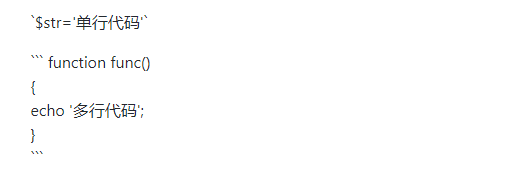
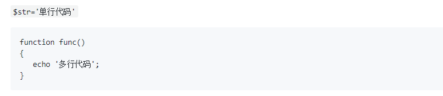
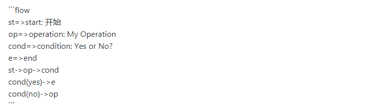
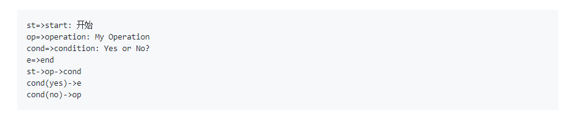

# markdown基本语法


 提示:可能有些语法显示的不明显！


## 一、标题

语法:

在想要设置为标题的文字前面加`#`来表示

示例:

```text
# 这是一级标题
## 这是二级标题
### 这是三级标题
#### 这是四级标题
##### 这是五级标题
###### 这是六级标题
```

 效果如下:


## 二、字体

### 2.1 加粗和倾斜

语法:

要加粗的文字左右分别用两个`*`号包起来  
要倾斜的文字左右分别用一个`*`号包起来  
要倾斜和加粗的文字左右分别用三个`*`号包起来  
要加删除线的文字左右分别用两个`~`号包起来

示例:

```text
*这是倾斜的文字*`
**这是加粗的文字**
***这是斜体加粗的文字***
~~这是加删除线的文字~~
```

 效果如下:


### 2.1 颜色、大小、字体类型

语法:

使用`font`标签，

```text
<font face="微软雅黑">我是微软雅黑</font> //设置字体类型 
<font color="#ff0000">我是红色</font>  //设置字体颜色
<font size="72px">我的大小为72px</font>  //设置字体大小
```

 示例:

```text
<font face="微软雅黑">我是微软雅黑</font>  
<font color="#ff0000">我是红色</font>  
<font size="72px">我的大小为72px</font>  
```

##  三、引用

语法:

在引用的文字前加&gt;即可。引用也可以嵌套，如加两个&gt;&gt;三个&gt;&gt;&gt;n个...

示例:

```text
>这是引用的内容
>>这是引用的内容
>>>>>>>>>>这是引用的内容
```

 效果如下:


## 四、分割线

语法:

三个或者三个以上的 - 或者 \* 都可以。

示例:

```text
---
----
***
*****
```

效果如下:


## 五、图片

语法:

```text


图片alt就是显示在图片下面的文字，相当于对图片内容的解释。
图片title是图片的标题，当鼠标移到图片上时显示的内容。title可加可不加
```

示例:

```text

```

效果如下:


## 六、超链接

语法:

```text
[超链接名](超链接地址 "超链接title")
title可加可不加
```

示例:

```text
[GitHub](https://github.com "GitHub")
[百度](http://baidu.com)
```

效果如下:

[GitHub](https://github.com) 

[百度](http://baidu.com)

## 七、列表

### 7.1 无序列表

语法:

无序列表用 - + \* 任何一种都可以

```text
- 列表内容
+ 列表内容
* 列表内容

注意：- + * 跟内容之间都要有一个空格
```

示例:

```text
- 列表内容
+ 列表内容
* 列表内容
```

效果如下:


### 7.2 有序列表

语法:

数字加点

```text
1. 列表内容
2. 列表内容
3. 列表内容

注意：序号跟内容之间要有空格
```

示例:

```text
1. 列表内容
2. 列表内容
3. 列表内容
```

效果如下:


### 7.3 列表嵌套

语法:

上一级和下一级之间敲3个空格即可

示例:

```text
- 一级无序列表内容
   - 二级无序列表内容
   - 二级无序列表内容
   - 二级无序列表内容
- 一级无序列表内容
   1. 二级有序列表内容
   2. 二级有序列表内容
   3. 二级有序列表内容  

1. 一级有序列表内容
   - 二级无序列表内容
   - 二级无序列表内容
   - 二级无序列表内容

2. 一级有序列表内容
   1. 二级无序列表内容
   2. 二级无序列表内容
   3. 二级无序列表内容
```

效果如下:



## 八、表格

语法:

```text
表头1|表头2|表头3|表头4
---|:--:|---:|:---
内容1|内容2|内容3|内容4
内容1|内容2|内容3|内容4

第二行分割表头和内容。
- 有一个就行，为了对齐，多加了几个
文字默认居左
-两边加：表示文字居中
-右边加：表示文字居右
-左边加：表示文字居左
注：原生的语法两边都要用 | 包起来。此处省略
```

```text
姓名|性别|年龄|血型
---|:--:|---:|:---
路飞|男|18|F型
娜美|女|19|X型
索隆|男|20|XF型
```

效果如下:


## 九、代码

语法:

```text
单行代码    `代码内容`

多行代码    ```
           代码内容
           ```
```

示例:



 效果如下:



## 十、流程图



 效果如下:



