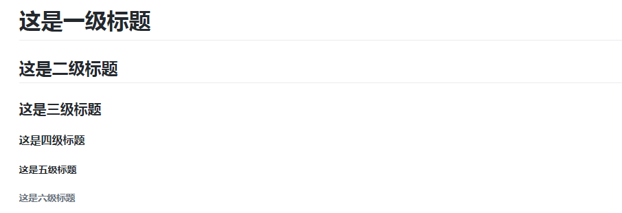
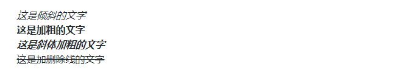

# markdown基本语法


 提示:可能有些语法显示的不明显！


## 一、标题

语法:

在想要设置为标题的文字前面加`#`来表示

示例:

```text
# 这是一级标题
## 这是二级标题
### 这是三级标题
#### 这是四级标题
##### 这是五级标题
###### 这是六级标题
```

 效果如下:



## 二、字体

### 2.1 加粗和倾斜

语法:

要加粗的文字左右分别用两个`*`号包起来  
要倾斜的文字左右分别用一个`*`号包起来  
要倾斜和加粗的文字左右分别用三个`*`号包起来  
要加删除线的文字左右分别用两个`~`号包起来

示例:

```text
*这是倾斜的文字*`
**这是加粗的文字**
***这是斜体加粗的文字***
~~这是加删除线的文字~~
```

 效果如下:



